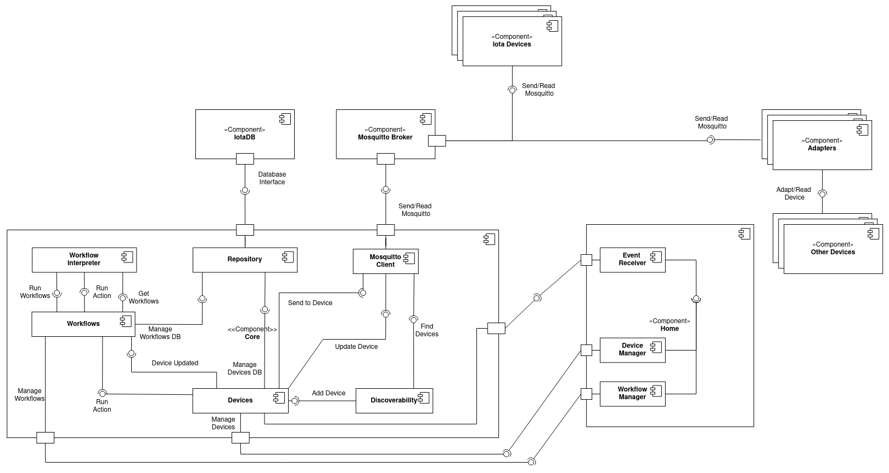
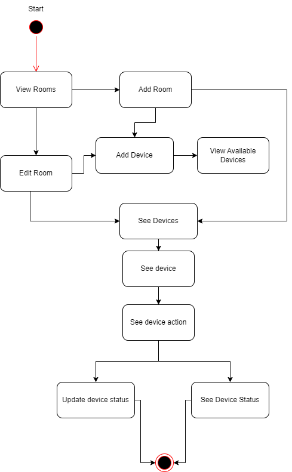
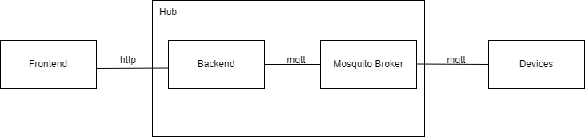
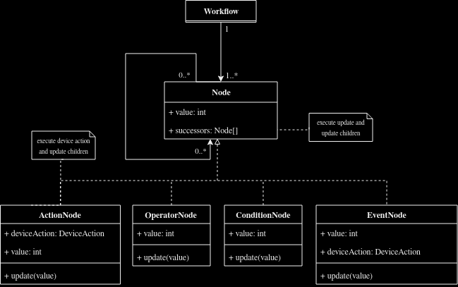
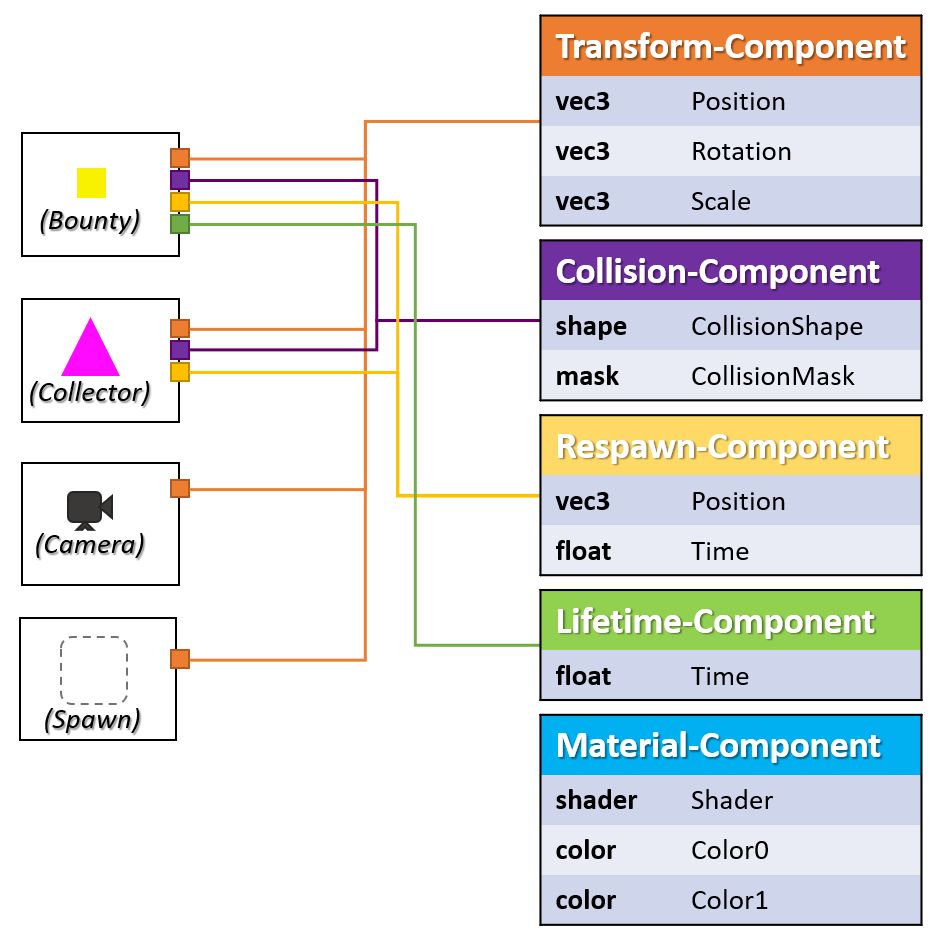

# High-level architecture 
<!-- Provide higher-level views over these three types of elements using Package diagrams, if appropriate -->

## Components



## Activities



## Infrastructure



# Technologies

<!-- Tools and rationale for choosing them (programming languages, frameworks, libraries, database engines, message queues). -->

## Front-end Technologies

### SvelteKit

One of the main reasons SvelteKit was chosen is its intuitive nature. SvelteKit embraces a component-based approach, making it easier to work with. 
Furthermore, SvelteKit's extensive documentation is a big help when starting to work with the framework. Finally, integrating TypeScript into SvelteKit was very easy, thanks to its compatibility and straightforward configuration process.

### Tailwind CSS

The utilization of Tailwind CSS significantly enhanced the frontend experience, offering a modern and efficient approach to building user interfaces. Tailwind CSS is a framework that provides a comprehensive set of pre-designed utility classes, which allowed to rapidly prototype and style the application. It is highly extensible and customizable and was used because some team members had already experience working with it.

## Back-end Technologies

### Spring Boot

Spring Boot, an extension of the Spring Framework, offers a toolkit for developing web applications. It supports both Java and Kotlin programming languages, with Kotlin being selected for this project due to its modernity and interoperability with Java.

Spring Boot was chosen because it is a framework that is easy to use, and has a well of documentation and community resources. It implements many features out of the box, like database access, relational mapping, and data validation. This allows us to focus on the business logic of the application, rather than spending time implementing these base components from scratch. Additionally, since some team members already had experience with Java and Kotlin, adopting Spring Boot provided a valuable opportunity to learn something new.

### MQTT

MQTT is a lightweight, publish-subscribe, machine to machine network protocol for message queue/message queuing service [Wikipedia](https://en.wikipedia.org/wiki/MQTT). 

MQTT was chosen due to its lightweight nature, which makes it ideal for IoT devices that don't have a lot of processing power or memory, and because it is a publish-subscribe protocol, which means that it is easy to add new devices to the system. It is also a widely used protocol, which means that there is a lot of documentation and community resources available, like client implementations for many programming languages.

For the MQTT broker, we chose the [Eclipse Mosquitto](https://mosquitto.org/) broker, which is an open-source broker that can be easily deployed on a server, as it is available as a Docker image.

We also used the [Eclipse Paho](https://www.eclipse.org/paho/) client library for both the Kotlin backend and the Python virtual devices, and the [PubSubClient](https://pubsubclient.knolleary.net/) library for the ESP32 devices.

## Devices

### Protocol

Each device will send information to the system about their device, such as name, actions and other meaninful information.

```json
{
  "mac": "B",
  "name": "Virtual Iota Colorful 1.0",
  "actions": [
    {
      "id": "1",
      "deviceAction": "toggle",
      "name": "toggle",
      "displayName": "Toggle",
      "status": "0"
    },
    {
      "id": "2",
      "deviceAction": "range",
      "name": "intensity",
      "displayName": "Intensity",
      "status": "150",
      "properties": {
        "min": "0",
        "max": "100",
        "step": "1"
      }
    },
    {
      "id": "3",
      "deviceAction": "rgb",
      "name": "color",
      "displayName": "Color",
      "status": "8c2d19"
    }
  ]
}

```

#### Discoverability

The device posts its configuration to the `DISCOVERABILITY` topic, which the core system is subscribed. Upon the receiption of these messages, the core system will store the device information in the database and post an acknowledge message in a different topic. Upon receiving the confirmation message, the device changes its state to the normal behaviour.

#### Updating values

In order to interact with the device, a json containing the action id and the value must be sent to the `ACTION-<MAC ADDRESS>` topic, which the device is subscribed. Upon receiption of these messages, the device updates its information and starts publishing the updated state of the device. The received information is in the following json format: 

```
{
    "id": "1",
    "status": "1"
}
```


The device also publishes its updated information to the `DATA-<MAC ADDRESS>` topic, so that the core system has the updated information without having to poll all of the devices. The device sends the information in the following json format:

```json

[
  {
    "id": "1",
    "status": "1"
  },
  {
    "id": "2",
    "status": "100"
  },
  {
    "id": "3",
    "status": "00ff00"
  }
]
```


### Real Devices

The real device, which was a blinking light, was implemented using Arduino. This languaged allows to easily develop and IoT device by providing several well implemented libraries. We used the `WiFiManager` library which allows the user to customize the device internet connection without editing the code directly. The user connects to a Wifi network hosted by the IoT device to setup the wifi ssid and password, and then the device works as expected.

To interact with the mosquitto broker, we used the `PubSubClient` library, which allowed us to quickly read and write to a topic in the mosquitto broker.

### Virtual Devices

The virtual devices are implemented using pygame to allow a more interesting experience and demonstration, and they use the `paho-mqtt` python library to interact with the mosquitto broker. Each of the devices can be called using `python <virtual device script>.py <desired fake mac address>`.

# Design and architecture
<!-- Document design and architecture problems and solutions, described preferably using pattern instances. Justify all design and architectural choices. -->

## Interpreter

The interpreter software pattern was followed to helps us achieve the workflows system.

We have 4 different types of nodes, which represent different types of rules. The entry nodes are action nodes, which have a reference to a specific device action that triggers the activation of the action node. The action node has children that might be either condition or operator nodes. Every node triggers the child nodes if the node's conditions are verified. The workflows end with the Action node that updates a device's value with the specified value by the user.



In order to implement this functionality with the interpreter software pattern, we mainly used two different design patterns, the visitor and the composite.

### Composite

#### Context

The workflow graph needs to be traverse troughout the several types of node, but they have common behaviour regarding updating the children. To address this problem, we use the composite pattern which allows each node to store sucessors and update the graph values recursively, until an event node is found.

#### Mapping

Each node extends the base class `Node` which contains a set of sucessor nodes. With the help of the visitor, each node has an `update` method. Each node verifies the its condition and when the condition is met, it will pass the control to the sucessors. We consider the `ActionNode` to be the Leaf node, as it marks the end of the graph.
 
#### Consequences

It easily allows to create a data structure similar to a tree graph, where each node might have different behaviour and update the values of whole tree based on the state of the rules of the workflow.

### Visitor

#### Context

The worfklow graphs need to be traversed to determine what actions should be executed. However, these graphs have different types of nodes that require different interpretations such as boolean operators, conditions, and actions. To address this, the visitor pattern is a useful pattern for adding functionality to these nodes without requiring significant changes to their classes. The visitor pattern also allows for different implementations to be designed for different visitors.

#### Mapping

The nodes are the elements being visited. The class `NodeVisitor`The `update` method invokes each of the different update methods and each one verifies if the class is the correct node type, otherwise it does nothing.

#### Consequences

It allows functionality to be added to the nodes without requiring significant changes to their classes. The visitor pattern also enforces that all node classes have implementations, even if the implementation does nothing. This improves readability and separates the different functionalities into a single class, which can also improve readability. Additionally, the visitor pattern is useful for accumulating information when traversing the graph, which could be used for flowing state through the nodes.

Everytime we need to create a new type of node, we simply need to add the method to the `NodeVisitor` class for the new type of node and veriify if it is the correct node. 

## Entity Component System



[Image Credits](https://www.codeproject.com/Articles/1216420/The-Entity-Component-System-BountyHunter-Game-Part)

## Context

The application aims to support various types of devices, with different purposes. Furthermore, it should allow new types of devices without requiring significant changes to the system. To address this, the entity component system is a useful pattern for adding new types of devices.

## Mapping

Entity component system (ECS) is a software architectural pattern commonly employed in video game development for the representation of objects in the game world. An ECS comprises entities composed from components of data, with systems which operate on entities' components.

ECS follows the principle of composition over inheritance, meaning that every entity is defined not by a type hierarchy, but by the components that are associated with it. Systems act globally over all entities which have the required components. [Wikipedia](https://en.wikipedia.org/wiki/Entity_component_system)

In ECS, entities are the objects that are being represented. Components hold data that labels the entities as having a certain property, for example health, or position. Systems act on entities that have the required components, for example a movement system would act on entities that have a position component.

In our application, we have identified the following components of the ECS:

- **Entities**: The entities in our application are represented by devices. These devices encompass the physical or virtual entities that we control or monitor.
- **Components**: Our components are the device actions associated with each device. These actions define the specific properties or capabilities of the device. Examples include checkbox, toggle, number, color, string, and range. Each device has a set of device actions, with each action having a name, value, and type. For example a light device might have a "toggle" action, with the value "true" and is called "on/off".
- **Systems**: Our application incorporates various systems that respond to different events and actions. Within each device, we have systems that act upon receiving MQTT messages. For instance, a system can process a "toggle" action on a light device to switch it on or off. We also have systems that react to device state updates, such as publishing temperature values from a sensor device to the MQTT broker. Additionally, workflows trigger systems that perform actions on devices. For instance, if a workflow is activated to turn on a light, a corresponding system sends a message to the light device to initiate the action. Furthermore, although it does not fall strictly within the definition of a system because it does not act on entities, the renderer displays the devices and their actions to the user.

## Consequences

The entity component system brings several advantages to our appplication. One of them is the ability to integrate new devices into the system with minimal modifications to the core application. We can create new entities with the necessary components and the system will automatically recognize them. The relevant systems will automatically act on the new entities if they have the required components. This allows for a high degree of flexibility and customization.

It also offers users the opportunity to create their own devices or adapt existing devices to suit their specific needs. Users can design devices with unique combinations of actions and further enhance their functionality through workflows, providing a plug-and-play experience.

However, the entity component system also has some drawbacks. One of them is that even though creating entities is easy, creating new components and systems can be more difficult. This is because the components and systems need to be programmed and integrated into the application. Furthermore, ensuring validation of the values associated with these components can be challenging. For instance, if a component is a range, we need to ensure that the value is within the specified range. This can be difficult to implement in a generic way that works for all components.

